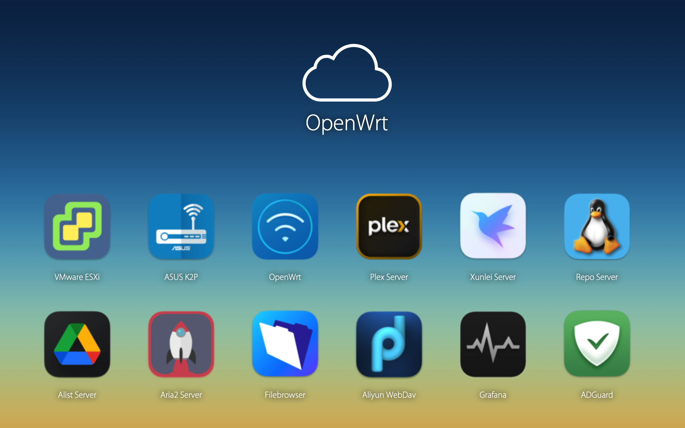
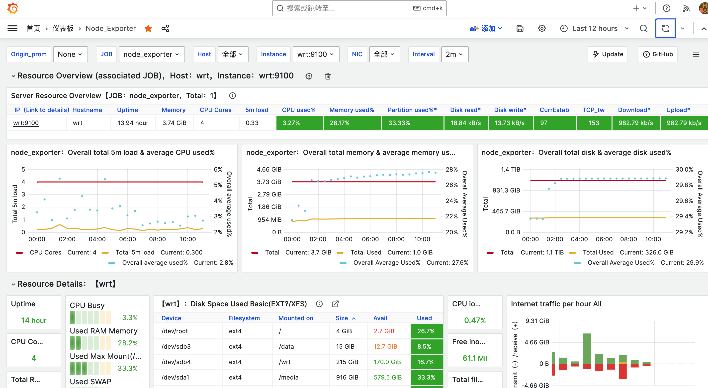
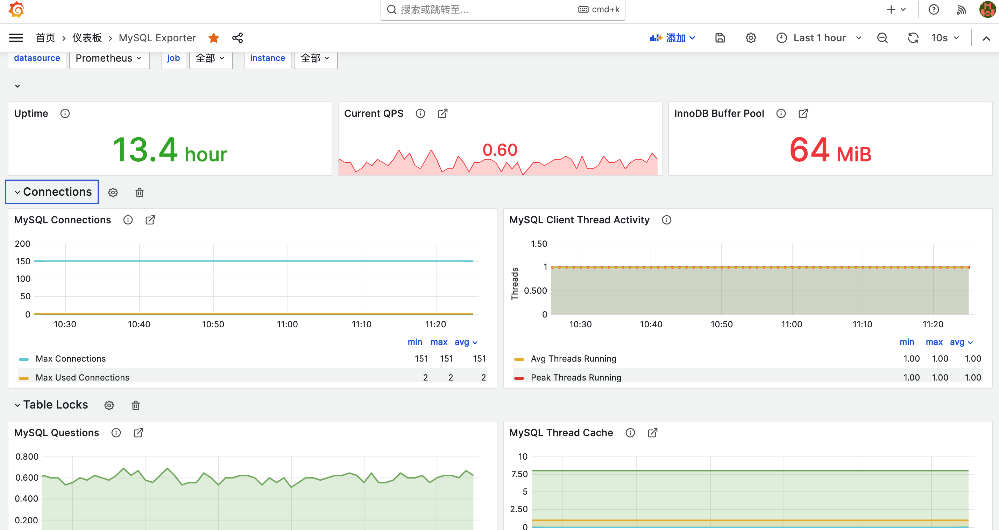

# 🏠 Home Page Dashboard

A lightweight, customizable **home dashboard** for local server/service monitoring. Built on **NGINX**, with optional **Prometheus + Grafana** support for a complete self-hosted monitoring solution.

------

## 🚀 Quick Start

### 🔧 Manual Setup

```bash
git clone https://github.com/Jas0n0ss/home-srv-apps.git
cp -r home-srv-apps/homepage /WebRootPath  # e.g., /var/www/html
```

### 🐳 Docker Setup

#### Option 1: Build Locally

```bash
git clone https://github.com/Jas0n0ss/home-srv-apps.git
cd home-srv-apps
docker build -t nginx:home-dashboard .
```

#### Option 2: Use Prebuilt Image

```bash
docker pull jas0n0ss/nginx:home
docker run --name home -p 80:80 -d jas0n0ss/nginx:home
```

Check that it's running:

```bash
curl -I http://localhost
```

📂 Access via: `http://localhost/` or your server IP.

------

## 🖼️ Dashboard Preview



------

## 📊 Prometheus + Grafana Monitoring (Optional)

Use the included [Prometheus Docker Compose files](prometheus/README.md) or run services manually.

👉 Download Prometheus: https://prometheus.io/download/

### Run Components

```bash
nohup ./prometheus --config.file="/data/opt/prometheus/prometheus.yml" &
nohup /data/opt/alertmanager/alertmanager --config.file=/data/opt/alertmanager/alertmanager.yml --log.level=debug > 2>&1 &
nohup /data/opt/blackbox_exporter/blackbox_exporter --config.file=/data/opt/blackbox_exporter/blackbox.yml &
nohup /data/opt/grafana-10.1.2/bin/grafana-server -homepath /data/opt/grafana-10.1.2 &
nohup /data/opt/node_exporter/node_exporter &
nohup /data/opt/mysqld_exporter/mysqld_exporter --config.my-cnf=/data/opt/mysqld_exporter/.my.cnf &
```

------

## 🧩 Prometheus Control Script

A simple Bash script to manage the Prometheus server:

```bash
#!/bin/bash

BINDIR="/data/opt/prometheus"

STOP() {
    killall prometheus
}

START() {
    pidof prometheus > /dev/null
    if [ $? -eq 0 ]; then
        echo "Prometheus is already running."
    else
        cd $BINDIR
        nohup ./prometheus --config.file="${BINDIR}/prometheus.yml" &
    fi
}

RESTART() {
    killall prometheus
    cd $BINDIR
    nohup ./prometheus --config.file="${BINDIR}/prometheus.yml" &
}

case "$1" in
    start)
        START
        ;;
    stop)
        STOP
        ;;
    restart)
        RESTART
        ;;
    *)
        echo "Only support start|stop|restart"
        ;;
esac
```

------

## 📸 Monitoring Screenshots

Prometheus UI:



Grafana Dashboard:



------

## 📁 Project Structure

```
home-srv-apps/
├── homepage/                   # Static homepage dashboard files
├── prometheus/                 # Prometheus config and exporters
├── docker-compose.yml          # Optional: Docker Compose setup
└── ...
```

------

## 🛠️ Future Enhancements

-  Add user authentication
-  Mobile responsiveness
-  Service auto-discovery for Docker
-  Custom Grafana panels for alerts

------

## 📜 License

MIT License 
