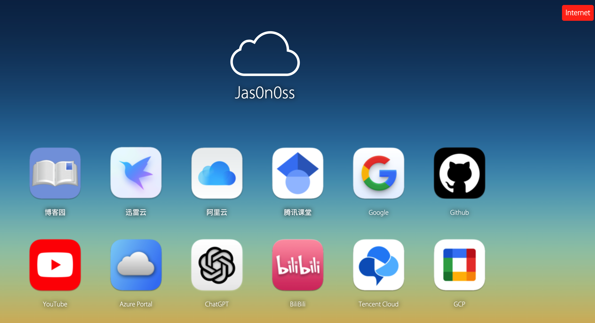

# home-srv-apps

#### Setup 

```bash
# docker-compose apply -f docker-apps.yml
# docker-compose -f docker-apps.yml ps
```

```bash
# docker-compose -f docker-apps.yml ps
  Name                 Command               State                                                              Ports
---------------------------------------------------------------------------------------------------------------------------------------------------------------------------------
alist       /entrypoint.sh                   Up      0.0.0.0:5244->5244/tcp,:::5244->5244/tcp
aria2-pro   /init                            Up      0.0.0.0:6800->6800/tcp,:::6800->6800/tcp, 0.0.0.0:6888->6888/tcp,:::6888->6888/tcp, 0.0.0.0:6888->6888/udp,:::6888->6888/udp
ariang      /darkhttpd /AriaNg --port  ...   Up
jellyfin    /init                            Up      0.0.0.0:8096->8096/tcp,:::8096->8096/tcp, 8920/tcp
sptest      docker-php-entrypoint bash ...   Up      80/tcp, 0.0.0.0:8010->8010/tcp,:::8010->8010/tcp
xunlei      /xunlei/xlp syno                 Up      0.0.0.0:2345->2345/tcp,:::2345->2345/tcp
02:13:51 root@homesrv docker-app ±|main ✗|→ docker-compose -f monitor.yml ps
     Name                    Command                  State                              Ports
---------------------------------------------------------------------------------------------------------------------
cadvisor          /usr/bin/cadvisor -logtostderr   Up (healthy)   0.0.0.0:8080->8080/tcp,:::8080->8080/tcp
grafana           /run.sh                          Up             0.0.0.0:3000->3000/tcp,:::3000->3000/tcp
mysql             docker-entrypoint.sh mysqld      Up             0.0.0.0:3306->3306/tcp,:::3306->3306/tcp, 33060/tcp
nginx-exporter    /usr/bin/nginx-prometheus- ...   Up             0.0.0.0:9113->9113/tcp,:::9113->9113/tcp
node-exporter     /bin/node_exporter               Up             0.0.0.0:9100->9100/tcp,:::9100->9100/tcp
prometheus        /bin/prometheus --config.f ...   Up             0.0.0.0:9090->9090/tcp,:::9090->9090/tcp
vmware_exporter   /usr/local/bin/vmware_exporter   Up             0.0.0.0:9272->9272/tcp,:::9272->9272/tcp
```
#### nginx.conf
```Nginx
server {
  listen 80;
  server_name v.srv;
  location / {
    proxy_pass http://127.0.0.1:8096;
  }
}
```
```bash
# curl -I http://v.srv
HTTP/1.1 302 Found
Server: openresty/1.21.4.1
Date: Sat, 18 Mar 2023 18:20:47 GMT
Connection: keep-alive
Location: /web/index.html
```

#### Home page Dashboard

Just keep it in your web root path, just enjoy it. You can find it [**here**](homepage/homepage.tgz).



