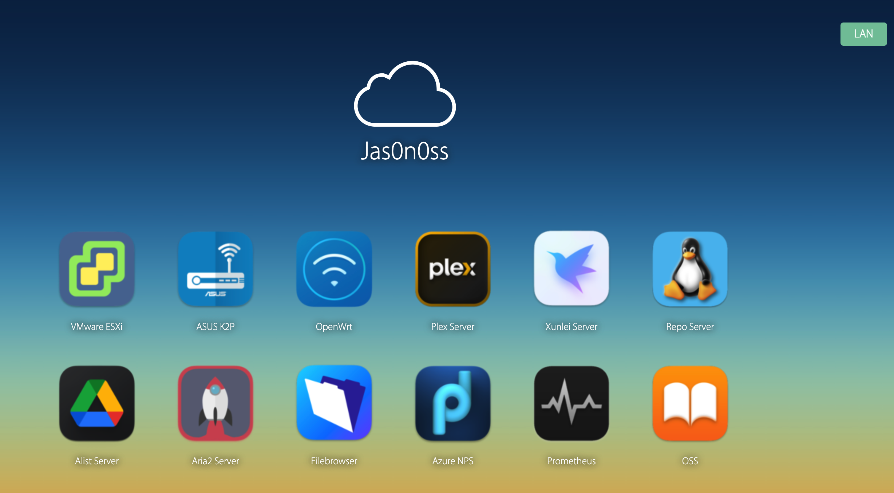

#### Home page Dashboard

##### Setup

```bash
git clone https://github.com/Jas0n0ss/home-srv-apps.git
cp -r home-srv-apps/homepage /WebRootPath
```

##### Docker version

```bash
# build on your own
git clone https://github.com/Jas0n0ss/home-srv-apps.git
cd home-srv-apps && docker build -t nginx:tag .
# use my image
docker pull jas0n0ss/nginx:home
docker run --name home -p 80:80 -it -d jas0n0ss/nginx:home
curl -I http://localhost
```

Just keep it in your web root path, then enjoy it. You can find it [**here**](homepage/homepage.tgz).




##### prometheus docker-compose yamls
prometheus [docker-compose common services yaml files](prometheus/README.md)
